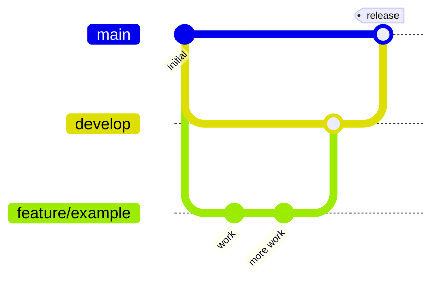

# GitHub workflow — Releases and branches

How code moves from a working branch to production in this repository, and which rules GitHub enforces along the way.

Decision record: [plans/004-branching-model-and-protection.md](../plans/004-branching-model-and-protection.md) (branch model) and [plans/003-check-deps-script.md](../plans/003-check-deps-script.md) (dependency gate).

## Branch model



| Branch | Role | Created from | Merges into | Direct pushes |
|---|---|---|---|---|
| `develop` | **Default branch.** Integration of all finished work. | `main` | `main` (release PR) | ❌ blocked |
| `main` | **Production only.** Contains exactly what is deployed. | — | — | ❌ blocked |
| `feature/<slug>` | New functionality | `develop` | `develop` | ✅ |
| `fix/<slug>` | Bug or quality fix | `develop` | `develop` | ✅ |
| `chore/<slug>` | Tooling, dependencies, CI, docs | `develop` | `develop` | ✅ |

- `develop` is the default branch, so new PRs target it automatically.
- `main` is never a target for day-to-day work. It only receives release PRs from `develop`.
- One topic per branch — ideally one plan from `plans/`.
- Use lowercase, hyphen-separated slugs: `fix/orders-tenant-scope`, `chore/upgrade-tsx`.

## Day-to-day flow

1. Start from an up-to-date `develop`:
   ```sh
   git switch develop
   git pull
   git switch -c fix/orders-tenant-scope
   ```
2. Commit in small steps, with descriptive messages.
3. Push and open a PR into `develop`:
   ```sh
   git push -u origin fix/orders-tenant-scope
   ```
4. Wait for the required checks (see [CI checks](#ci-checks)). If `develop` moved ahead, update the branch before merging (required on `develop`).
5. Merge with **"Create a merge commit"** — the only method enabled. Squash and rebase are disabled so every commit stays visible in the history.

## Release flow

A release is a PR from `develop` into `main`.

1. Open a PR with base `main` and head `develop`.
2. Required checks: `check-deps` and `release-source`.
3. Merge with **"Create a merge commit"**.
4. `main` now reflects production.

The release merge commit exists only on `main`; `develop` doesn't need it back. That's why `main` does **not** require the branch to be up to date — otherwise every release would require pushing that merge commit to `develop`, which its own rules forbid.

## CI checks

Defined in [`.github/workflows/ci.yml`](../.github/workflows/ci.yml). They run on every PR into `develop` or `main`, and can be started manually (`workflow_dispatch`).

### `check-deps`

Runs `npm run check:deps` ([`src/scripts/check-deps.ts`](../src/scripts/check-deps.ts)), which wraps `npm audit --json` (prod + dev dependencies) and applies this policy:

| Result | Effect |
|---|---|
| `critical` or `high` vulnerability | ❌ Error — the check fails and the PR can't be merged |
| `moderate` or `low` vulnerability | ⚠️ Warning annotation on the PR — the check passes |
| `info` | Ignored |
| `npm audit` could not run (registry/network error, unexpected output) | ❌ Error `npm audit could not run: <reason>` — the check fails, since nothing was verified |

Each finding shows the package, severity, advisory title and URL, whether it's a direct or transitive dependency, whether it's prod or dev, and whether a fix is available.

Run it locally before opening a PR:

```sh
npm run check:deps
```

The job installs with `npm ci --ignore-scripts` (no third-party install scripts in a security check) on Node 24.

### `release-source`

Runs only on PRs into `main`. It fails unless the PR's head branch is `develop` **from this same repository**, so a feature branch — or a fork's branch named `develop` — can't be merged into production directly. On PRs into `develop` it is skipped, which counts as passing.

## Branch protection

Both branches are protected with repository **rulesets**. There are **no bypass actors** — the rules also apply to repository admins.

| Rule | `develop` | `main` |
|---|---|---|
| Deletion blocked | ✅ | ✅ |
| Force pushes blocked | ✅ | ✅ |
| Pull request required | ✅ | ✅ |
| Required approvals | 0 | 0 |
| Allowed merge method | Merge commit | Merge commit |
| Required checks | `check-deps` | `check-deps`, `release-source` |
| Branch must be up to date | ✅ | ❌ (see [Release flow](#release-flow)) |
| Checks must be reported by GitHub Actions | ✅ | ✅ |

"Checks must be reported by GitHub Actions" (`integration_id: 15368`) means a commit status posted manually with the same name doesn't satisfy the rule.

### Where the rules live

The ruleset definitions are versioned in [`.github/rulesets/`](../.github/rulesets/). GitHub doesn't read that folder automatically — the files are applied with the GitHub CLI.

| Ruleset | File | GitHub id |
|---|---|---|
| `develop` | [`.github/rulesets/develop.json`](../.github/rulesets/develop.json) | `22970322` |
| `main` | [`.github/rulesets/main.json`](../.github/rulesets/main.json) | `22970325` |

To change a rule, edit the JSON file in a PR, and after it's merged apply it:

```sh
gh api -X PUT repos/carlossas/recruiting-challenge/rulesets/<id> --input .github/rulesets/<branch>.json
```

To inspect what is actually enforced on a branch:

```sh
gh api repos/carlossas/recruiting-challenge/rules/branches/develop
```

### Repository settings

- Default branch: `develop`.
- Merge methods: merge commit only (squash and rebase disabled).

## Not covered yet

- **Code review:** approvals are set to 0 because the repository has a single maintainer (GitHub doesn't allow approving your own PR). Raise `required_approving_review_count` when more people contribute.
- **Hotfixes:** there is no `hotfix/*` flow from `main`. Urgent fixes follow the normal path (`fix/*` → `develop` → release).
- **Deployment:** merging into `main` defines what production should run, but no deployment pipeline is wired to it yet.
- **Tags / versioning / changelog:** releases are not tagged.
- **Other CI checks:** tests and type-checking don't run in CI yet; only `check-deps` and `release-source` do.
